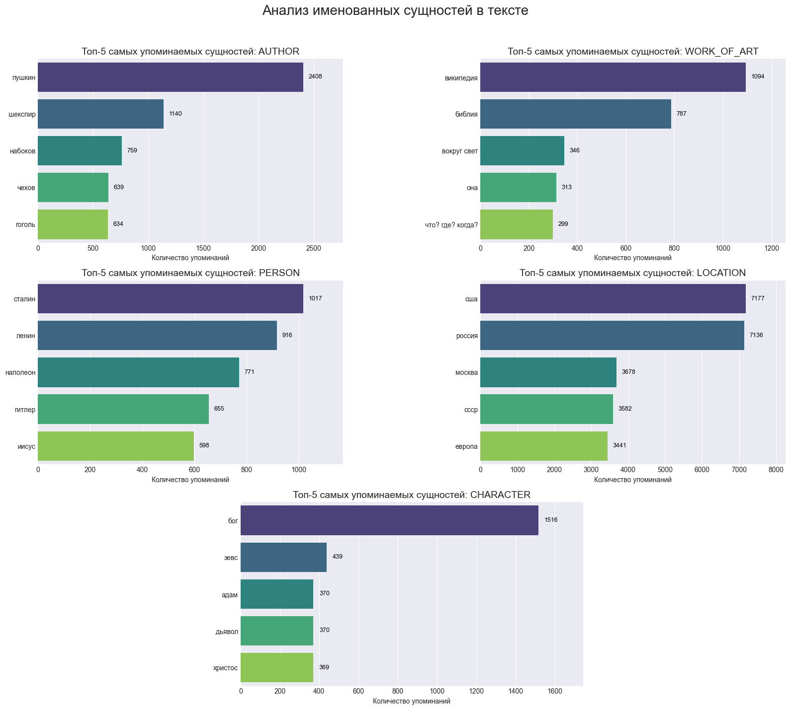

# Анализ вопросов "Что? Где? Когда?" и NER-модель для извлечения сущностей

Этот проект представляет собой комплексный анализ данных из мира интеллектуальной игры "Что? Где? Когда?". Цель — исследовать статистические закономерности в вопросах и разработать специализированную модель для распознавания именованных сущностей (NER), таких как авторы, произведения искусства и локации.

Проект охватывает полный цикл Data Science: от сбора и очистки данных до обучения и развертывания ML-модели.

## Ключевые особенности

*   **Сбор данных:** Собрано и обработано **~300,000 вопросов** из двух крупнейших баз (`db.chgk.info` и `gotquestions.online`).
*   **Современный подход к разметке:** Для обучения модели использовался эффективный метод **LLM-assisted labeling**: предварительная разметка через OpenAI API с последующей валидацией и корректировкой в Label Studio.
*   **Кастомная NER-модель:** Дообучена модель на базе `ai-forever/ruBert-large` для извлечения 5 специфичных для домена сущностей. Модель опубликована на [Hugging Face Hub](https://huggingface.co/borisMI/ChGK_NER).
*   **Интерактивное демо:** Работу модели можно протестировать в реальном времени через веб-приложение на [Hugging Face Spaces](https://huggingface.co/spaces/borisMI/ChGK_NER_demo).
*   **Визуализация результатов:** Построены наглядные графики, демонстрирующие популярность и динамику упоминания различных сущностей.

## Интерактивное демо

Вы можете протестировать NER-модель в действии. Введите свой текст вопроса и посмотрите, какие сущности она найдет!

**➡️ [Перейти к интерактивному демо на Hugging Face Spaces](https://huggingface.co/spaces/borisMI/ChGK_NER_demo) ⬅️**

## Технологический стек

*   **Сбор данных:** `requests`, `BeautifulSoup4`
*   **Анализ и обработка:** `pandas`, `numpy`, `spaCy`, `pymorphy3`
*   **Визуализация:** `matplotlib`, `seaborn`
*   **Машинное обучение:** `PyTorch`, `transformers`
*   **Среда разработки:** `Jupyter Notebook`

## Этапы проекта

### 1. Сбор и сравнение данных

На первом этапе были изучены две основные базы вопросов: `db.chgk.info` (есть публичное API) и `gotquestions.online` (API отсутствует). Данные с `gotquestions.online` были получены с помощью скрапинга.

Сравнение показало, что до 2019 года обе базы сопоставимы по полноте, однако для анализа более свежих данных (2020+) база `gotquestions.online` является значительно более полной. В итоге для дальнейшего анализа был использован датасет, собранный с `gotquestions.online`, общим объемом около 300 тысяч вопросов.

### 2. Разработка кастомной NER-модели

Стандартные NER-модели не всегда корректно распознают специфические для данной области сущности, например, `WORK_OF_ART`. Поэтому было принято решение дообучить собственную модель.

#### Процесс разметки

Для обучения было размечено **2000 вопросов**. Процесс был организован в два этапа для максимальной эффективности:
1.  **Предварительная разметка:** Написан скрипт, который использует **OpenAI API** для генерации первоначальной разметки.
2.  **Валидация и коррекция:** Полученная разметка загружалась в **Label Studio**, где вручную проверялась и исправлялась.

Такой подход позволил значительно ускорить процесс создания обучающей выборки.

#### Архитектура и сущности

Модель дообучена на основе `ai-forever/ruBert-large` и способна распознавать 5 типов сущностей:
*   `AUTHOR`: Авторы (писатели, художники, композиторы и т.д.)
*   `CHARACTER`: Персонажи (литературные, вымышленные)
*   `LOCATION`: Локации (города, страны, географические объекты)
*   `PERSON`: Персоналии (реальные исторические личности, ученые, политики)
*   `WORK_OF_ART`: Произведения искусства (книги, картины, фильмы и т.д.)

#### Качество модели

Метрики качества (F1-score) на тестовой выборке:

| Категория     | F1-score |
|---------------|----------|
| `AUTHOR`      | 0.826    |
| `LOCATION`    | 0.825    |
| `WORK_OF_ART` | 0.810    |
| `CHARACTER`   | 0.672    |
| `PERSON`      | 0.625    |

Высокие метрики для `AUTHOR`, `LOCATION` и `WORK_OF_ART` показывают, что модель успешно справляется с основной задачей. Более низкие значения для `PERSON` и `CHARACTER` могут быть связаны с их большей неоднозначностью.

### 3. Результаты анализа и визуализации

С помощью обученной модели были извлечены сущности из всей базы вопросов. Это позволило построить статистику и выявить интересные закономерности.

#### Топ-5 самых популярных сущностей

#### Динамика популярности

Накопительные диаграммы показывают, как менялась частота упоминания самых популярных сущностей с течением времени.

#### Ключевые выводы

Анализ извлеченных сущностей позволяет составить "портрет" среднестатистического вопроса "Что? Где? Когда?" и выявить его ключевые культурные и исторические маркеры.

*   **Литературоцентричность:** Безоговорочным лидером среди авторов является **А.С. Пушкин**, упоминаемый более чем в два раза чаще Шекспира. В топ также входят классики русской литературы — Набоков, Чехов и Гоголь. Это подчеркивает фундаментальную роль классической, в первую очередь русской, литературы в игре.

*   **Исторический фокус:** Среди персоналий доминируют ключевые фигуры советской и мировой истории (**Сталин, Ленин, Наполеон**). Высокая частотность упоминания **СССР** как локации также подтверждает, что значительная часть вопросов так или иначе связана с историческим контекстом XX века.

*   **Библейские и мифологические сюжеты:** Сущность **"Бог"** является абсолютным лидером в категории `CHARACTER`, многократно опережая остальных. Вместе с частым упоминанием **Библии**, **Иисуса**, **Адама** и **Дьявола**, это указывает на то, что религиозные тексты и сюжеты являются одним из важнейших источников для вопросов. Вторым по значимости пластом является античная мифология (**Зевс**).

*   **Географический баланс:** В вопросах наблюдается паритет между упоминаниями **России** и **США**, что говорит о широком географическом охвате. При этом **Москва** является самой упоминаемой городской локацией, что естественно для русскоязычной игры.

*   **Эволюция источников:** График динамики показывает, что упоминания **"Википедии"** как произведения (`WORK_OF_ART`) начали резко расти с середины 2000-х годов, что отражает изменение источников информации и появление вопросов, связанных с интернет-культурой.

*   **Стабильность "вечных тем":** Динамика упоминаний показывает, что лидеры в своих категориях (Пушкин, Бог, Сталин/Ленин) сохраняли свою популярность на протяжении всей истории игры с 1990-х годов. Их доминирование не является недавним трендом, а составляет основу "культурного кода" ЧГК.

